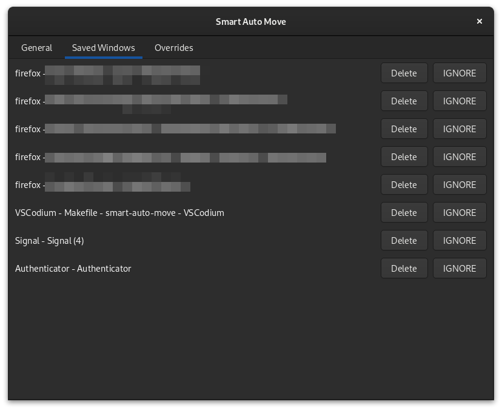
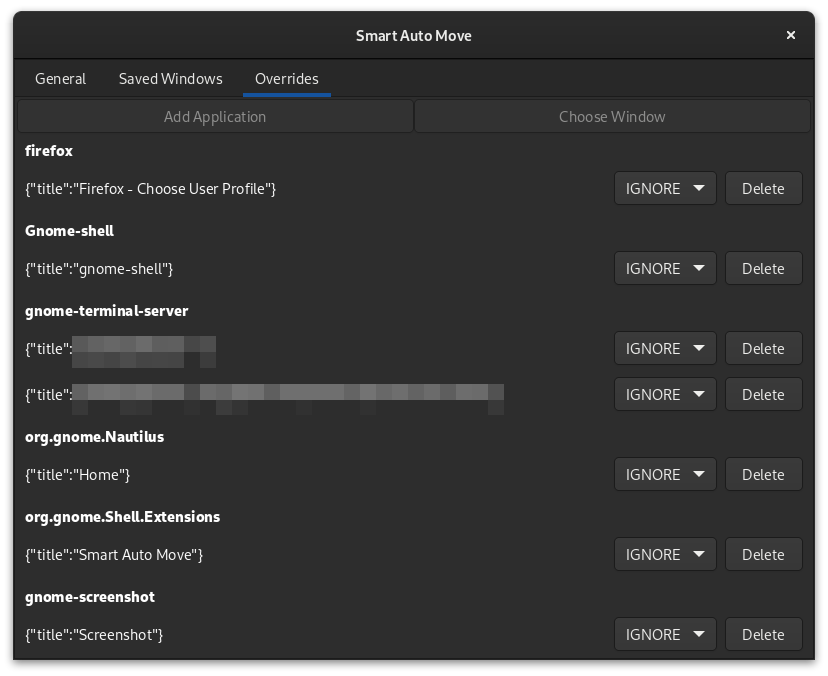

# smart-auto-move

smart-auto-move is a Gnome Shell extension which keeps track of all application windows and restores them to the previous position, size, and workspace on restart. Supports Wayland.

<p align="left">
  <a href="https://extensions.gnome.org/extension/4736/smart-auto-move/">
    
  </a>
</p>

## screenshots





## getting started

most settings can be modified via the extension preferences dialog.

### defaults

the first step is to choose your **Default Synchronization Mode**: `IGNORE` or `RESTORE`.

`IGNORE` will keep track of windows but will not restore any unless an **Override** is created.

`RESTORE` will keep track and restore all windows unless an **Override** is created.

default **Match Threshold** is probably fine to keep as is.

if you'd like to optimize resource usage, you can change **Sync Frequency** and **Save Frequency**.

once you are happy with your setup, you can **Freeze Saves** to prevent any changes to your saved windows. note, however, that this will pvevent windows from being tracked when their titles change.

### overrides

to create an override, visit the **Saved Windows** tab.

to create an override for a specific window, click **OVERRIDE**.

to create an override for an entire application, click **OVERRIDE (ANY)**.

after you've created an override, visit the **Overrides** tab.

you can change the IGNORE/RESTORE behavior here for apps and windows.

for apps, you can also control the Match Threshold.

if you have an app which needs looser matching (eg. if the title changes between restarts) reduce the threshold.

for tighter matching, increase it.

## limitations

terminals which include the current directory in the title may not reach the match threshold when restarted if they do not preserve the working directory across restarts.

to work around this, create a per-app override (see above) and set the threshold to a lower value, eg. `0.2`

## behavior

because there is no way to uniquely distinguish individual windows from an application across restarts, smart-auto-move uses a heuristic to uniquely identify them. this is primarily based on startup order and title. in cases where there are multiple windows with the same title, they are restored based on relative startup sequence.

titles are matched using Levenstein distance. the match bonus for title is calculated based on `(title length - distance) / title length`.

## settings

most settings can be modified from the preferences GUI. this section documents all of the dconf values and is only recommended for advanced users.

enable debug logging:

```
$ dconf write /org/gnome/shell/extensions/smart-auto-move/debug-logging true
```

set the minimum window/title match threshold to 50%:

```
$ dconf write /org/gnome/shell/extensions/smart-auto-move/match-threshold 0.5
```

set the window synchronization (update/restore) frequency to 50ms:

```
$ dconf write /org/gnome/shell/extensions/smart-auto-move/sync-frequency 50
```

default to ignoring windows unless explicitly defined. restore all windows of the gnome-calculator app, all firefox windows except for the profile chooser, and Nautilus only if the window title is "Downloads":

```
$ dconf write /org/gnome/shell/extensions/smart-auto-move/sync-mode "'IGNORE'"
$ dconf write /org/gnome/shell/extensions/smart-auto-move/overrides '{"gnome-calculator": [{"action":1}], "firefox": [{"query": {"title": "Firefox - Choose User Profile"}, "action": 0}, {"action": 1}],"org.gnome.Nautilus":[{"query":{"title":"Downloads"},"action":1}]}'
```

default to restoring all windows, but ignore the firefox profile chooser and any nautilus windows:

```
$ dconf write /org/gnome/shell/extensions/smart-auto-move/sync-mode "'RESTORE'"
$ dconf write /org/gnome/shell/extensions/smart-auto-move/overrides '{"firefox": [{"query": {"title": "Firefox - Choose User Profile"}, "action": 0}], "org.gnome.Nautilus": [{"action":0}]}'
```

show all saved firefox windows (N.B. `jq` will fail if window title contains `\`):

```
$ dconf read /org/gnome/shell/extensions/smart-auto-move/saved-windows | sed "s/^'//; s/'$//" | jq -C .Firefox | less -SR
```

there are example configs in the `examples/` dir which can be loaded (N.B. while extension is disabled) with:

```
$ dconf load /org/gnome/shell/extensions/smart-auto-move/ < ./examples/default-restore.dconf
```

you can backup your config (restore is the same as above):

```
$ dconf dump /org/gnome/shell/extensions/smart-auto-move/ > smart-auto-move.dconf
```

the gsettings tool can also be used to manipulate these values:

```
$ gsettings --schemadir ./smart-auto-move@khimaros.com/schemas/ set org.gnome.shell.extensions.smart-auto-move sync-mode 'RESTORE'
```

## development

NOTE: this process has only been tested with GNOME running on wayland.

clone this repository and run `make start`.

this will do the following:

- build the extension pack .zip
- install the extension pack
- launch a nested wayland Gnome-Shell session

after the nested instance is running, you will need to enable the extension:

```
$ gnome-extensions enable smart-auto-move@khimaros.com
```

if you make a change to the source code, you will need to exit the session and start a new one.

## publishing

1. update `metadata.json` to latest uploaded version + 1
1. generate the extension zip with `make`
1. upload the zip to extensions.gnome.org
1. repeat as needed if a version is rejected

## manual tests

### calculator

- open calculator
- move calculator position
- resize calculator
- close calculator
- open calculator
- quickly close calculator
- open calculator

### files

- open Places => Home
- open a second Places => Home
- tile first window to the left
- move second Home window
- close first Home window
- change second Home window to Downloads
- close Downloads window
- open Places -> Downloads
- open Places -> Home
- move Downloads to workspace 2
- tile Downloads to the right

### firefox

- launch firefox
- navigate to Wikipedia.org
- open second window
- navigate to Mozilla.org
- move first window to workspace 2
- tile first window to left
- tile second window to right
- firefox Menu -> Quit
- launch firefox
- open new tab in Mozilla window
- navigate to Google.com
- firefox Menu -> Quit
- launch firefox
