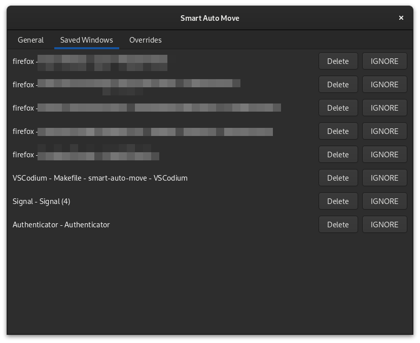
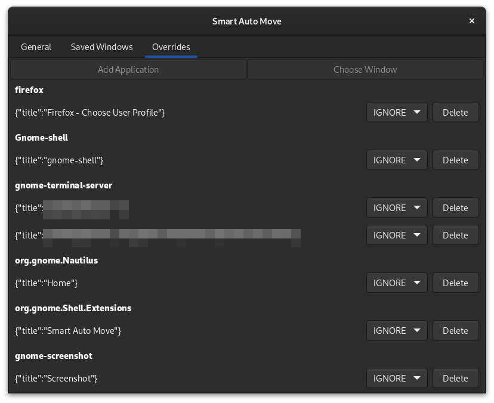

# smart-auto-move

smart-auto-move is a Gnome Shell extension which keeps track of all application windows and restores them to the previous position, size, and workspace on restart. Supports Wayland.

<p align="left">
  <a href="https://extensions.gnome.org/extension/4736/smart-auto-move/">
    
  </a>
</p>

**NOTE**: this extension follows the GNOME version in Debian "testing". if you are using a bleeding edge GNOME release, you can "Disable version validation" at https://extensions.gnome.org/local/ to install this extension on any GNOME version before it is officially supported.

## screenshots





## getting started

most settings can be modified via the extension preferences dialog.

### defaults

the first step is to choose your **Default Synchronization Mode**: `IGNORE` or `RESTORE`. `IGNORE` will keep track of windows but will not restore any unless an **Override** with `RESTORE` behavior is created. `RESTORE` will keep track and restore all windows unless an **Override** with `IGNORE` behavior is created.

next is to choose your global **Match Threshold**, the default works well for most use cases. a number closer to `0.0` will match windows with less similar attributes, whereas `1.0` requires an exact match.

advanced users can tune window matching behavior with parameters like **New Window Max Wait Time**, **New Window Title Stability**, and other timing settings in the preferences.

after you've dialed in your overrides, the learning apparatus can be paused. enable **Freeze Saves** to prevent changes to Saved Windows. N.B. this will lose track of windows if their titles change.

### overrides

to create an override, visit the **Saved Windows** tab.

to create an override for a specific window, click **OVERRIDE**.

to create an override for an entire application, click **OVERRIDE (ANY)**.

after you've created an override, visit the **Overrides** tab.

you can change the IGNORE/RESTORE behavior here for apps and windows.

for applications, a custom **Match Threshold** can be set.

## upgrading

### upgrading from v35 or earlier

when upgrading from version 35 or earlier to version 36+, the extension will automatically migrate your settings:

- **saved window positions are cleared** - the internal data format has changed significantly and cannot be converted automatically. your windows will be re-learned as you use them.
- **overrides are preserved** - all your IGNORE/RESTORE rules and custom thresholds will be migrated automatically.
- **settings are preserved** - global preferences remain unchanged.

no manual intervention is required. the migration happens automatically on first load.

## limitations

LIMITATION: terminals which include the current directory in the title may not reach the match threshold if they do not preserve the working directory across restarts. WORKAROUND: create a per-app override (see above) and set the threshold to a lower value, eg. `0.2`

## troubleshooting

if everything is horribly broken, clear your Saved Windows:

```
$ gnome-extensions disable smart-auto-move@khimaros.com

$ dconf reset /org/gnome/shell/extensions/smart-auto-move/saved-windows

$ gnome-extensions enable smart-auto-move@khimaros.com
```

## behavior

because there is no way to uniquely distinguish individual windows from an application across restarts, smart-auto-move uses a heuristic to identify them, based on application id (wm_class) and title similarity (character histogram distance).

a window's identity is resolved once, shortly after it appears:

- a window whose title exactly matches a remembered window of the same application is restored immediately.
- a window with a distinctive title is matched after its title has been stable briefly (**New Window Title Stability**).
- a window with a short generic title (e.g. a splash screen or "Loading...") waits for the title to become specific before matching, up to the **Generic Title Extended Wait**, when remembered windows of the same application exist.
- multiple simultaneous windows with very similar titles are held until they can be told apart or the wait times out.

once a window has been matched (or learned as new), it is never moved again because its title changed. later title changes only update the remembered identity. windows are only repositioned after that point when the monitor layout changes.

multi-monitor layouts are remembered per physical connector: each window keeps a separate saved position for every monitor it has been placed on, and moves to the most recently preferred connected monitor when displays are added or removed (e.g. docking and undocking).

see [DESIGN.md](DESIGN.md) for the full state machine.

## settings

most settings can be modified from the preferences GUI. this section documents all of the dconf values and is only recommended for advanced users.

enable debug logging:

```
$ dconf write /org/gnome/shell/extensions/smart-auto-move/debug-logging true
```

set the minimum window/title match threshold to 50%:

```
$ dconf write /org/gnome/shell/extensions/smart-auto-move/match-threshold 0.5
```

set the maximum wait time for new window title stabilization to 15 seconds:

```
$ dconf write /org/gnome/shell/extensions/smart-auto-move/new-window-max-wait-ms 15000
```

default to ignoring windows unless explicitly defined. restore all windows of the gnome-calculator app, all firefox windows except for the profile chooser, and Nautilus only if the window title is "Downloads":

```
$ dconf write /org/gnome/shell/extensions/smart-auto-move/sync-mode "'IGNORE'"
$ dconf write /org/gnome/shell/extensions/smart-auto-move/overrides \''{"gnome-calculator": [{"action":"RESTORE"}], "firefox": [{"title": "Firefox - Choose User Profile", "action": "IGNORE"}, {"action": "RESTORE"}], "org.gnome.Nautilus": [{"title": "Downloads", "action": "RESTORE"}]}'\'
```

default to restoring all windows, but ignore the firefox profile chooser and any nautilus windows:

```
$ dconf write /org/gnome/shell/extensions/smart-auto-move/sync-mode "'RESTORE'"
$ dconf write /org/gnome/shell/extensions/smart-auto-move/overrides \''{"firefox": [{"title": "Firefox - Choose User Profile", "action": "IGNORE"}], "org.gnome.Nautilus": [{"action": "IGNORE"}]}'\'
```

an override rule may also set a per-app `threshold` (match threshold) and `match_properties` (which window properties to restore, e.g. `["workspace"]`).

show all saved firefox windows (N.B. `jq` will fail if window title contains `\`):

```
$ dconf read /org/gnome/shell/extensions/smart-auto-move/saved-windows | sed "s/^'//; s/'$//" | jq -C '[ .[] | select(.props.wm_class == "firefox") ]' | less -SR
```

there are example configs in the `examples/` dir which can be loaded (N.B. while extension is disabled) with:

```
$ dconf load /org/gnome/shell/extensions/smart-auto-move/ < ./examples/default-restore.dconf
```

you can backup your config (restore is the same as above):

```
$ dconf dump /org/gnome/shell/extensions/smart-auto-move/ > smart-auto-move.dconf
```

the gsettings tool can also be used to manipulate these values:

```
$ gsettings --schemadir ./smart-auto-move@khimaros.com/schemas/ set org.gnome.shell.extensions.smart-auto-move sync-mode 'RESTORE'
```
